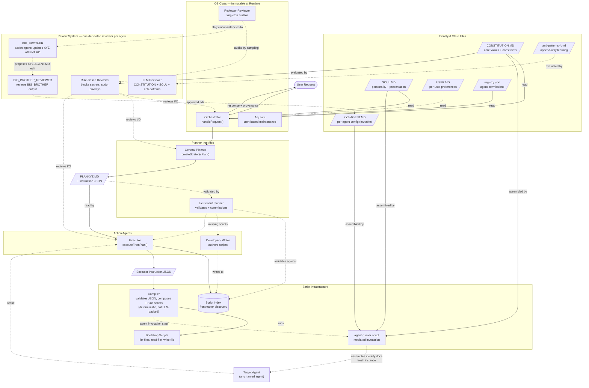

# [*Agent*](../../dictionary.md) Invocation Model

**Decision: Mediated Invocation via Executor (Option 2)**

## System Diagram

> **Maintenance note:** This diagram represents the full ideal architecture. When a component is added, removed, or a flow changes, update the diagram to reflect the intended design. Implementation status and phase tracking are in `docs/planning/Roadmap.md`.




When a planner determines it needs to call another agent (e.g., a Social-Communication-[*Planner*](../../dictionary.md) commissioning a Google-API-Developer to write a script), invocation is mediated through the executor/script infrastructure.

## Chosen Approach: Mediated Invocation via Executor

> *Note: The agent-runner concept described below has been replaced by the Job Graph model (see [JobGraph.md](JobGraph.md)). Current implementation uses direct function calls; Job Graph is the Tier 4 target. The original text is preserved for design lineage.*

The planner produces a PLANXYZ.MD that includes an agent invocation step. The executor writes an instruction that calls a static "agent-runner" script — a script that takes the name of the agent to call, assembles its context (implicitly including [*Soul*](../../dictionary.md), [*Constitution*](../../dictionary.md), and whatever else is required), invokes it, and returns something like a promise: execution resumes after the child agent completes, with the requested information or side effects produced. This keeps all invocation flowing through the same reviewed, scripted infrastructure.

This approach is consistent with the architecture's philosophy: everything is a script, everything is reviewed, the executor can only write text files. It requires defining the agent-runner script's interface — what context it assembles, how it handles failures, and how return values propagate back up the call chain.

## Fallback: Direct Instantiation

If implementation reveals the mediated approach is overkill, the system can fall back to direct instantiation: the planner creates an instance of the target agent directly, passing inputs and receiving outputs. Simpler, but means every planner needs the capability to spawn agents, and the invocation itself bypasses the executor/script infrastructure.

## Thread Management & Concurrency

Race conditions arise when multiple agents attempt to edit the same configuration file simultaneously. The system needs synchronization primitives for concurrent agent config updates.

Candidate mechanisms:
- Locks (simple, risk of deadlock)
- Queues (serialized mutations, safer)
- Single-threaded mutation model (all config writes go through one bottleneck)

The concurrency model requires specification before multi-agent parallelism is implemented. See [OpenQuestions.md §2](../planning/OpenQuestions.md#2-inter-agent-communication-protocol) for candidate mechanisms and open questions.

## Layer Boundary Protocol

Each agent-to-agent boundary should have standardized expectations for:
- Return format (what a successful response looks like)
- Error format (what a failure looks like)
- Timeout behavior (how long to wait before treating a call as failed)

This prevents each agent pair from inventing its own conventions.

## Crash Handling & Retries

When an agent invocation crashes:
1. Automatic retry is triggered
2. Maximum retries: 2 additional attempts (3 total)
3. After 3 failures: escalate — surface to the calling agent or to the user, depending on stack depth

Escalation behavior after exhausted retries is tracked in [OpenQuestions.md §2](../planning/OpenQuestions.md#2-inter-agent-communication-protocol).

## Inter-*Agent* Communication Protocol

**Decision: Custom JSON message passing over MCP.**

MCP's client-server model mismatches the mediated invocation architecture. Custom format fits naturally into the executor output → script-runner → agent-runner flow. Messages are reviewable text files — greppable and debuggable. Synchronous execution model doesn't need MCP's complexity.

**MCP reservation**: Consider MCP for *external* system integration (Gmail, Calendar, databases, third-party APIs), not internal agent-to-agent communication.

### Message Schema

**Request format:**
```json
{
  "from_agent": "Social-Communication-Planner",
  "to_agent": "Google-API-Developer",
  "request_type": "commission_script",
  "correlation_id": "job-123-step-5",
  "payload": {
    "description": "OAuth2 token refresh for Gmail API",
    "inputs": ["refresh_token", "client_id"],
    "outputs": ["access_token", "expiry"]
  }
}
```

**Response format:**
```json
{
  "correlation_id": "job-123-step-5",
  "status": "success | failure | pending",
  "payload": { },
  "error": "optional error details"
}
```

### Schema Definition — Hybrid Approach

**Message envelope** (rigid, enforced):
- `from_agent`, `to_agent`, `correlation_id`, `request_type` — always present
- `status` — responses only; `error` — failures only
- `payload` — flexible object

**Payload structure** (initially flexible, formalize over time):
- Early: agents experiment with necessary fields
- Patterns emerge from usage; mature request types get formal schemas
- Validation optional until a schema exists for that request type

Rationale: infrastructure needs rigid contracts; business logic needs experimentation room.

### Capability Discovery & Permissions

The Agent Registry is the authoritative source for what agents exist. **Permissions are stored in the registry but NOT exposed to agents** — this reduces attack surface.

- *Agent* A can query: "Does Google-API-Developer exist?"
- *Agent* A cannot query: "Am I allowed to call Google-API-Developer?"
- When *Agent* A requests invocation, the Executor-Reviewer checks permissions
- Failed permission checks → [*Flag-and-Continue*](../../dictionary.md) or [*FAFC*](../../dictionary.md) depending on stack depth

### Input/Output Scoping

Agents should receive only the data they need. Scoping dimensions:
- Which identity files an agent can read ([*XYZ-AGENT.MD*](../../dictionary.md), SOUL.MD, subset of logs?)
- Which data fields an agent can access from the parent request
- What an agent is allowed to produce (file types, destinations, side effects)

Example: Developer-[*Reviewer*](../../dictionary.md) can read `anti-patterns-developer.md` but not `anti-patterns-planner.md`.

Scoping specification format and enforcement mechanism are [TBD] — see [OpenQuestions.md §2](../planning/OpenQuestions.md#2-inter-agent-communication-protocol).

### Concrete Invocation Flow

When Orchestrator needs to call General-*Planner*:

1. **Orchestrator** produces a message → reviewed by Orchestrator-*Reviewer*
2. **Executor** receives the (approved) message, writes instruction file referencing `agent-runner` script → reviewed by Executor-*Reviewer*
3. **Script-Runner** reads instruction file, calls `agent-runner` with the message
4. **agent-runner** validates envelope, assembles target agent context (*Soul*, CONSTITUTION.MD, *XYZ-AGENT.MD*, scoped files), invokes target via LLM API, returns response
5. Response propagates back to Executor, then up the chain

## Open Questions

- *Agent*-Runner script interface: what context does it assemble? How does it construct the target agent's prompt? What gets injected automatically?
- Return value propagation: synchronously block caller until response? Write to temp file? Queue-based async (future)?
- Failure modes: target crashes (retry?), times out (how long?), returns malformed response (who validates?), retries exhausted (escalation path?)
- Concurrency: can multiple agents invoke the same target simultaneously? Locking mechanism for shared resources (*XYZ-AGENT.MD* edits)? Queue serialization vs. parallel execution?
- Schema evolution: who validates conformance? How do payload schemas for mature request types get published?
- Input/Output scoping: specification format? Enforcement mechanism? *Reviewer* validation of scope adherence?
- *Agent* lifecycle: pooling/reuse vs. fresh creation? API cost management?
