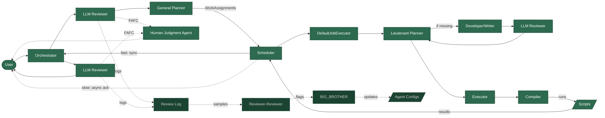

# Writ Implementation Roadmap

### Key Files
See `CLAUDE.md` for the full source file map.

---

## Component Status

| Component | Status |
|---|---|
| Orchestrator, General *Planner*, Executor | Built — Phase 1 |
| PLAN-{id}.md + instruction JSON | Built — Phase 1 |
| Script Runner + bootstrap scripts | Built — Phase 1 |
| [*Script Index*](../dictionary.md) (frontmatter discovery) | Built — Phase 1 |
| SOUL.md, CONSTITUTION.md, registry.json | Built — Phase 1 |
| XYZ-AGENT.md per-agent config files | Built — Phase 1 |
| Rule-Based [*Reviewer*](../dictionary.md) (`reviewer.ts`) | Built — Phase 2 (fast fallback for LLM reviewer) |
| `withReview()` HOF + `applyReview()` (`reviewed.ts`) | Built — Phase 2 |
| LLM *Reviewer* (`llm-reviewer.ts`) | Built — Phase 2 |
| Session persistence (`runtime/sessions/current.json`) | Built — Phase 2 |
| [*Compiler*](../dictionary.md) (deterministic: validates JSON, composes + runs scripts) | Built — Phase 2 |
| LLM *Reviewer* (wired in orchestrator) | Built — Phase 2 |
| XYZ-REVIEWER-AGENT.md per-agent reviewer configs | Built — Phase 2 |
| IOAdapter + CLIAdapter (`src/io/`) | Built — Phase 3 |
| Human-Judgment Agent (HJA) | Built — Phase 3 Tier 1 (completed 2026-02-24) |
| Anti-patterns lists + loader + append utility | Built — Phase 3 Tier 1 (completed 2026-02-24) |
| FAFC review decision + ReviewOptions refactor | Built — Phase 3 Tier 1 (completed 2026-02-24) |
| `callWithValidation()` LLM utility | Built — Phase 3 Tier 1 (completed 2026-02-24) |
| Boundary validation (compile/executor Zod parse) | Built — Phase 3 Tier 1 (completed 2026-02-24) |
| Developer / Writer | Built — Phase 3 Tier 2 (completed 2026-02-25) |
| Lieutenant *Planner* + GP → LP → Executor pipeline | Built — Phase 3 Tier 2 (completed 2026-02-25) |
| Review decision logging | Built — Phase 3 Tier 3 (completed 2026-02-25) |
| [*Reviewer-Reviewer*](../dictionary.md) | Built — Phase 3 Tier 3 (completed 2026-02-25) |
| [*BIG_BROTHER*](../dictionary.md) + BIG_BROTHER_REVIEWER | Built — Phase 3 Tier 3 (completed 2026-02-25) |
| Review Sampling Rate | Built — Phase 3 Tier 3 (completed 2026-02-25) |
| Identity Writer (atomic config writes + backups) | Built — Phase 3 Tier 3 (completed 2026-02-25) |
| Pre-Execution Semantic Review (stubbed gate) | Built — Phase 3 Tier 3 (completed 2026-02-25) |
| Integration Test Harness (`TestAdapter`, `MockLLMClient`, 5 smoke tests) | Built — Phase 3 Tier 3 (completed 2026-03-11) |
| Job Graph & Scheduler | Built — Phase 3 Tier 4 (completed 2026-03-20) |
| Initiative system | Phase 3 — Tier 4 — [#46](https://github.com/hikusukih/writ/issues/46) |
| USER.md / Get-to-know-the-user | Phase 3 — Tier 6 — [#49](https://github.com/hikusukih/writ/issues/49) |
| Adjutant | Phase 3 — Tier 5 — [#48](https://github.com/hikusukih/writ/issues/48) |

---

## Current Build State (Phase 3 Tier 4)

*The Scheduler is the execution backbone. Orchestrator calls the General Planner to partition work into WorkAssignments, then creates a job DAG and submits it to the Scheduler. DefaultJobExecutor routes each job type to the appropriate pipeline agent. Fast jobs (under 10 s) respond synchronously; slow jobs send an async acknowledgement and deliver results when complete (throbber pattern). LLM Reviewer runs after Orchestrator (before GP) and after final response (before User). Developer/Writer reviewer runs before script promotion. FAFC decisions route through the Human-Judgment Agent. Review decisions are logged; Reviewer-Reviewer samples and audits them, flagging BIG_BROTHER for config updates. Rule-Based Reviewer is the fast fallback at all review points.*

---

## Phase 2: Reviewer Chain & Compiler

### 2.1 Compiler `[x]` (completed 2026-02-19)
- Deterministic Compiler layer: validates instruction JSON, composes and runs scripts
- Script frontmatter discovery (`@name`/`@description`/`@param`)
- `ALLOWED_ROOT` path scoping; shell script execution with timeout

### 2.2 Session Persistence `[x]` (completed 2026-02-20)
- `loadSession()`/`saveSession()` persisting conversation history to `runtime/sessions/current.json`
- Restore session prompt at startup

### 2.3 Side-Effect Provenance `[x]` (completed 2026-02-20)
- Side-effect summary appended to history entries after each turn (script IDs, params, exit codes)

### 2.4 Review Chain Wiring `[x]` (completed 2026-02-20)
- `withReview()` HOF and `applyReview()` wired into orchestrator agent chain
- Rule-based reviewer as fast pre-filter and fallback

### 2.5 LLM-Based Reviewer `[x]` (completed 2026-02-20)
- `reviewWithLLM()` passing SOUL.md + CONSTITUTION.md to Claude for review
- Falls back to rule-based reviewer on parse/API failure

### 2.6 Configurable ALLOWED_ROOT + Bootstrap Scripts `[x]` (completed 2026-02-20)
- `ALLOWED_ROOT` computed from `$0` at runtime; overridable via `WRIT_ALLOWED_ROOT`
- 6 bootstrap scripts: `git-status`, `append-file`, `search-content`, `list-files`, `read-file`, `write-file`

### 2.6.5 XYZ-AGENT.md Rewrite `[x]` (completed 2026-02-20)
- Rewrote per-agent config files as LLM-optimized prompts

### 2.7 Per-Agent Reviewer Configs `[x]` (completed 2026-02-20)
- `{id}-reviewer-agent.md` files carrying role-specific reviewer guidance
- Loaded by `loader.ts` into `IdentityContext.reviewerConfigs`

---

## Phase 3: Self-Improvement & Extended *Agent*

> Items are listed in intended implementation order, numbered for cross-referencing. Items within a tier can overlap; tiers should not be skipped. Backlog items are referenced for sequencing but remain in `docs/planning/backlog/` until promoted.

These require the full Phase 2 review chain before they're safe to build. Developer/Writer and Lieutenant *Planner* are moved here because: (a) they require a working LLM *Reviewer* to safely commission and validate new scripts, and (b) they don't unblock anything in Phase 2.

### 3.1 IOAdapter — Messaging Interface `[x]` (completed 2026-02-23)
- `IOAdapter` interface: `sendResult`, `sendError`, `sendReviewBlock`, `sendStatus`, `onRequest`, `start`, `stop`
- `CLIAdapter` (`src/io/CLIAdapter.ts`): first implementation; wraps Node readline + console via `createCLIAdapter()` factory
- `src/index.ts` refactored to route all I/O through the adapter; future adapters (HTTP, webhooks, dashboard) drop in without touching agent logic

---

*Tier 1 — Foundation: cheap, near-zero behavior change, unlocks or de-risks everything downstream.* Task list: [`tasks-tier1-foundation.md`](tasks/tasks-tier1-foundation.md)

- **(2)** **Human-Judgment Agent (HJA)** `[x]` (completed 2026-02-24): FAFC as 5th ReviewDecision. `IOAdapter.requestConfirmation()` presents summary + collects yes/no. HJA module generates summary via LLM, routes through IOAdapter. Wired into `applyReview()` via ReviewOptions object pattern. Also: `callWithValidation()` utility, boundary Zod validation in compile/executor.
- **(3)** **Anti-pattern lists** `[x]` (completed 2026-02-24): Per-agent append-only files loaded by `loadIdentity()` into `IdentityContext.antiPatterns`. Included in LLM reviewer prompt. `appendAntiPattern()` utility for future BIG_BROTHER use.

*Tier 2 — Capability Expansion: expands what the system can do; required for the self-improvement chain to be meaningful.* Task list: [`tasks-tier2-capability.md`](tasks/tasks-tier2-capability.md)

- **(4)** **Developer/Writer *Agent*** `[x]` (completed 2026-02-25): `src/agents/developer-writer.ts` — LLM generates scripts from capability descriptions with `@name`/`@description`/`@param` frontmatter. Stage → review via Developer-Reviewer → promote to live `src/instance/scripts/`. Staging in `runtime/staging/scripts/`. Registered in `registry.json` as action class.
- **(5)** **Lieutenant *Planner*** `[x]` (completed 2026-02-25): `src/agents/lieutenant-planner.ts` — receives work assignments from General *Planner*, produces script-level execution specs. Detects missing scripts → commissions Developer/Writer (cap 3 per invocation). General *Planner* refactored to strategic role (`createStrategicPlan()` → `WorkAssignment[]`). Full pipeline: GP → LP → Executor for all requests.

*Tier 3 — Self-Improvement Chain (strict internal order within this tier).* Task list: [`tasks-tier3-self-improvement.md`](tasks/tasks-tier3-self-improvement.md)

- **(6)** **Reviewer-Reviewer** `[x]` (completed 2026-02-25): Review decision logging to `runtime/logs/review-decisions.jsonl`. RR (`src/agents/reviewer-reviewer.ts`) samples from log, audits constitutional consistency. Flags trigger BIG_BROTHER. OS class, hardcoded config path.
- **(7)** **BIG_BROTHER + BIG_BROTHER_REVIEWER** `[x]` (completed 2026-02-25): `src/agents/big-brother.ts` — receives `ViolationSummary` from RR. Proposes config updates via LLM. BB-Reviewer reviews. Self-modification loop with 3-round cap.
- **(8)** **Review Sampling Rate System** `[x]` (completed 2026-02-25): `src/agents/sampling-rate.ts` — per-agent dynamic rate. Clean invocations decay toward floor (5%, OS 15%). Flags reset to 100%. Integrated into `applyReview()`.
- **(9)** **XYZ-AGENT.md self-modification** `[x]` (completed 2026-02-25): `src/identity/writer.ts` — atomic write functions with backup to `runtime/config-backups/`. Used by BIG_BROTHER.
- **(10)** **Pre-Execution Semantic Review** `[x]` (completed 2026-02-25): `src/agents/semantic-review.ts` — stubbed gate (off by default). Wired into `compile()` after validation, before execution.
- **(10.5)** **Integration Test Harness** `[x]` (completed 2026-03-11): `src/io/TestAdapter.ts` — IOAdapter collecting all output into inspectable arrays. `src/io/MockLLMClient.ts` — pattern-matched mock LLM client returning agent-appropriate responses. `src/integration/pipeline.integration.test.ts` — 5 smoke tests: basic request/response, script execution, review chain, FAFC escalation (mock-only), DW trigger (mock-only). Separate vitest config (`vitest.integration.config.ts`). `npm run test:integration` / `npm run test:all`. `USE_REAL_LLM=1` runs tests 1–3 with real API; 4–5 skip.

*Tier 4 — Async + Initiatives.* Task list: [`tasks-tier4-async-initiatives.md`](tasks/tasks-tier4-async-initiatives.md)

*Tier 4 is the architectural transition point: the linear GP → LP → Executor pipeline is replaced by job-based dispatch. After Tier 4, all execution routes through the Job Graph.*

- **(11)** **Job Graph & Scheduler** `[x]` (completed 2026-03-20): `src/jobs/` — Job types (`execute_script`, `develop_script`, `plan`, `notify_user`, `replan`, `initiative_setup`). Monotonic IDs for cycle prevention. Persistent store in `runtime/jobs/`. DAG scheduler with dependency resolution, concurrent execution (default limit 3), callbacks. Orchestrator refactored to job-based dispatch; `DefaultJobExecutor` routes job types to GP/LP/DW/Executor/Compiler. Throbber/ack pattern: configurable timeout per job type, synchronous UX for fast jobs, async follow-up for slow ones. Channel routing via `IOAdapter.getChannel()`. See [JobGraph.md](../architecture/JobGraph.md) for the architecture spec.
- **(12)** **User Statement Log** *(Backlog)* `[ ]` — **[#1](https://github.com/hikusukih/writ/issues/1)**: `src/statements/` — append-only log in `runtime/statements/`. N:N evidence join between jobs and statements. Supersession lifecycle. Wired into Orchestrator for statement extraction. See [`backlog-statement-log.md`](backlog/backlog-statement-log.md).
- **(13)** **Initiative Table & Persistence** *(Backlog)* `[ ]` — **[#2](https://github.com/hikusukih/writ/issues/2)**: `src/initiatives/` — persistent table in `runtime/initiatives/`. Cron expressions, architecture types, stop conditions. Separate from job store. See [`backlog-initiative-table.md`](backlog/backlog-initiative-table.md).
- **(14)** **Initiative system** `[ ]` — **[#46](https://github.com/hikusukih/writ/issues/46)**: InitiativeBuilder agent registered in `registry.json`. LLM determines initiative parameters from Orchestrator-identified patterns. Non-Static architectures route through HJA. Cron trigger stub (checked per orchestrator tick, not system cron). See [OpenQuestions.md §Initiatives](OpenQuestions.md#initiatives).

*Tier 5 — Infrastructure + Deployment.* Note: the Adjutant's core (OS-class agent + AgentMD + system-class initiatives) does not require containerization and could be built in Tier 4 immediately after the Initiative system. It lives in Tier 5 because tasks that interact with container-local services (Gitea, etc.) compose naturally here.

- **Gist-based command channel** *(In progress)* — **[#47](https://github.com/hikusukih/writ/issues/47)** (parent; sub-issues [#33](https://github.com/hikusukih/writ/issues/33), [#35](https://github.com/hikusukih/writ/issues/35), [#36](https://github.com/hikusukih/writ/issues/36)): Private GitHub Gist as pull-based command channel for the live instance. Poll script fetches Gist and writes to `runtime/inbox/` (filesystem dead drop). IOAdapter integration pending. Bootstrap cron documented; Writ should self-schedule polling as an early self-management task. See [ADR-0001](../decisions/0001-gist-command-channel.md).

- **(15)** **Containerization** *(Backlog)* — **[#4](https://github.com/hikusukih/writ/issues/4)**: AgentOS as a self-contained deployable container. Prerequisite for Gitea and dashboard. Stabilize the system first. See [`docs/planning/backlog/backlog-containerization.md`](backlog/backlog-containerization.md).
- **(16)** **Adjutant** — **[#48](https://github.com/hikusukih/writ/issues/48)**: Cron-based maintenance + LLM-backed advisor. Runs inside the container.
- **(17)** **Gitea Integration** *(Backlog)* — **[#5](https://github.com/hikusukih/writ/issues/5)**: Embedded Gitea for script repo hosting and human inspection. Depends on containerization. See [`docs/planning/backlog/backlog-gitea.md`](backlog/backlog-gitea.md).
- **(18)** **Script Branch Workflow + Code-Reviewing-Agent** *(Backlog)* — **[#6](https://github.com/hikusukih/writ/issues/6)**: Scripts developed on branches, merged via reviewed PR. Depends on Gitea. See [`docs/planning/backlog/backlog-branch-workflow.md`](backlog/backlog-branch-workflow.md).

*Tier 6 — Quality of Life + Polish*

- **(19)** **Get-to-know-the-user** — **[#49](https://github.com/hikusukih/writ/issues/49)**: Proactive onboarding loop, periodic USER.MD updates via conversation, and honest disclosure of system shortcomings and known failure modes to the user. No hard dependencies.
- **(20)** **Prompt evolution** — **[#50](https://github.com/hikusukih/writ/issues/50)**: A/B testing of prompt changes with performance tracking. Needs BIG_BROTHER running first to have data.
- **(21)** **Model management** — **[#51](https://github.com/hikusukih/writ/issues/51)**: Router selecting cheapest competent model per task. Low urgency until enough distinct task types exist to route across. See also [#28](https://github.com/hikusukih/writ/issues/28) (Ollama-specific subset).
- **(22)** **System health assessment / agent refresh** — **[#52](https://github.com/hikusukih/writ/issues/52)**: Proactive coherence maintenance — periodic review of agent configs against CONSTITUTION.MD and SOUL.MD outside of flag triggers. Natural once BIG_BROTHER is stable. See [OpenQuestions.md §16](OpenQuestions.md#16-system-health-assessment--agent-refresh).
- **(23)** **Web Dashboard** *(Backlog)* — **[#7](https://github.com/hikusukih/writ/issues/7)**: Browser UI for system visibility, job status, review history, FAFC resolution. Depends on IOAdapter + containerization. See [`docs/planning/backlog/backlog-dashboard.md`](backlog/backlog-dashboard.md).

*Tier 7 — Speculative*

- **(24)** **ClawdBot Integration & Untrusted Execution** *(Backlog)* — **[#8](https://github.com/hikusukih/writ/issues/8)**: Sandbox model for imported skills/agents outside Writ's review chain. When the core system is solid. See [`docs/planning/backlog/backlog-clawdbot.md`](backlog/backlog-clawdbot.md).

---

### Sequencing Notes

- **Two-Loop / Async Architecture** *(Backlog)* is absorbed by IOAdapter (3.1) + Job Graph & Scheduler (11). No standalone implementation needed.
- Items within a tier may be parallelized where there's no intra-tier dependency.
- This order reflects the current design. Revisit if a Phase 3 item reveals an untracked dependency.

---

## Technical Debt / Known Issues
- Node 18 vitest engine warning (vitest 4.x wants Node 20+)
- No error recovery for Claude API failures (rate limits, network)
- `request-modifications` review decision is returned but not acted on (no agent re-call loop yet — Phase 3)
